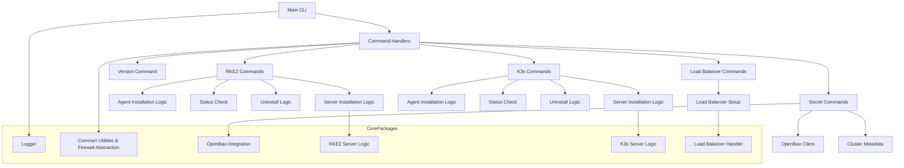

# Architectural Overview of EdgeCTL

## Overview
EdgeCTL is a CLI tool designed to manage edge cloud infrastructure. It provides functionality for provisioning Kubernetes clusters, managing secrets, and interacting with load balancers. The architecture is modular, leveraging Go packages and external tools like OpenBao and RKE2.

---

## High-Level Architecture

---

## Components

### 1. **Main CLI**
- **File:** `main.go`
- **Description:** Entry point for the CLI. Delegates execution to the `cmd` package.

### 2. **Command Handlers**
- **Directory:** `cmd/`
- **Description:** Contains subcommands for managing RKE2, K3s, secrets, and load balancers.
  - `rke2.go`: Handles RKE2 cluster operations.
  - `k3s.go`: Handles K3s cluster operations.
  - `secrets.go`: Manages secrets in OpenBao.
  - `version.go`: Displays CLI version.
  - `rke2/lb/commands.go`, `k3s/lb/commands.go`: Manages load balancer setup and status.

### 3. **Core Packages**
- **Logger**
  - **File:** `pkg/logger/log.go`
  - **Description:** Provides logging functionality using `zerolog`.

- **Common Utilities & Firewall Abstraction**
  - **File:** `pkg/common/`
  - **Description:** Contains shared utilities including embedded scripts, OS detection, firewall abstraction (UFW, firewalld, iptables), host configuration, and helper functions.

- **Secret Store Integration**
  - **File:** `pkg/vault/`
  - **Description:** Handles interactions with OpenBao for secrets management.

- **RKE2 Server Logic**
  - **File:** `pkg/rke2/server/install.go`
  - **Description:** Implements logic for installing and managing RKE2 servers.

- **K3s Server Logic**
  - **File:** `pkg/k3s/server/install.go`
  - **Description:** Implements logic for installing and managing K3s servers.

- **Load Balancer Handler**
  - **File:** `pkg/lb/handler.go`
  - **Description:** Manages HAProxy and Keepalived configurations for load balancing.

---

## External Dependencies

### 1. **OpenBao**
- Used for secure storage and retrieval of secrets (Linux Foundation fork of HashiCorp Vault).

### 2. **RKE2**
- Security-focused Kubernetes distribution with CIS hardening for edge environments.

### 3. **K3s**
- Lightweight, CNCF-certified Kubernetes distribution for edge, IoT, and resource-constrained environments.

### 3. **HAProxy + Keepalived**
- Provides high availability and load balancing for RKE2 clusters.

---

## Future Enhancements
- Implement a debug command for connectivity verification.
- Introduce multi-tenant support via OpenBao namespaces.
- Add `--dry-run` support to all commands.
- Interface pattern for pluggable secret backends.

---

## Diagram Legend
- **Main CLI:** Entry point for the application.
- **Command Handlers:** Subcommands for specific functionalities.
- **Core Packages:** Reusable logic and utilities.
- **External Dependencies:** Third-party tools and services.